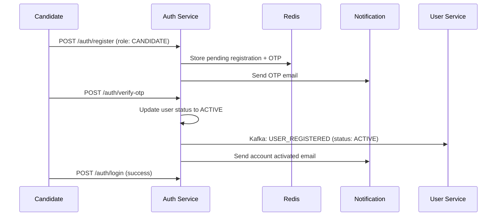
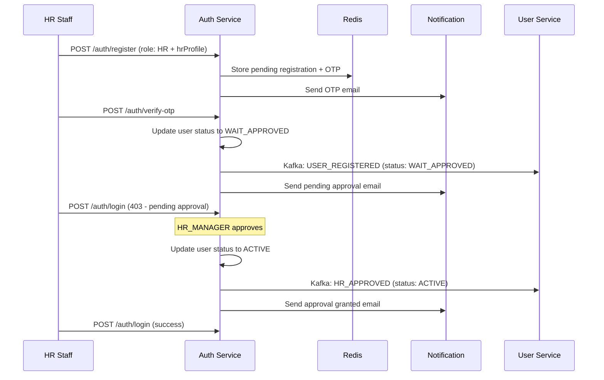
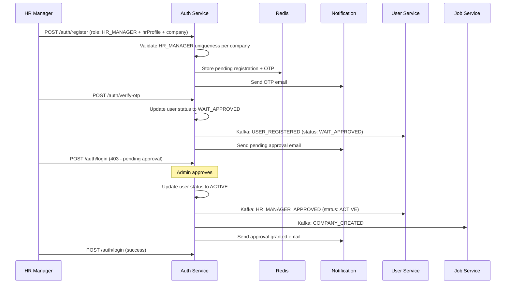

# WorkFitAI - Registration & Approval Flow

## Overview

This document describes the complete role-based registration and approval workflow implemented in the WorkFitAI platform.

## Architecture

The system consists of three main microservices:
- **auth-service** (Port 8081): Handles authentication, registration, OTP verification, and approvals
- **user-service** (Port 8082): Manages user profiles and data 
- **job-service** (Port 8083): Handles companies and job postings

## User Roles

1. **CANDIDATE**: Regular job seekers - automatically activated after OTP verification
2. **HR**: HR staff - requires HR_MANAGER approval after OTP verification
3. **HR_MANAGER**: HR managers - requires admin approval after OTP verification
4. **ADMIN**: System administrators - pre-seeded accounts

## Registration Flow

### 1. Candidate Registration


### 2. HR Registration


### 3. HR_MANAGER Registration


## API Endpoints

### Authentication
- `POST /api/v1/auth/register` - Role-based registration
- `POST /api/v1/auth/verify-otp` - OTP verification
- `POST /api/v1/auth/login` - User login
- `POST /api/v1/auth/logout` - User logout
- `POST /api/v1/auth/refresh` - Refresh token

### Approval Management
- `GET /api/v1/admin/pending-approvals` - Get pending approvals (Admin only)
- `POST /api/v1/admin/approve-hr-manager/{userId}` - Approve HR_MANAGER (Admin only)
- `POST /api/v1/admin/approve-hr/{userId}` - Approve HR (HR_MANAGER only)

## Registration Request Formats

### Candidate Registration
```json
{
  "username": "candidate_test",
  "email": "candidate@example.com",
  "password": "password123",
  "fullName": "Test Candidate", 
  "phoneNumber": "+84901234567",
  "role": "CANDIDATE"
}
```

### HR Registration
```json
{
  "username": "hr_test",
  "email": "hr@example.com",
  "password": "password123",
  "fullName": "Test HR Staff",
  "phoneNumber": "+84912345678",
  "role": "HR",
  "hrProfile": {
    "department": "Human Resources",
    "companyId": "550e8400-e29b-41d4-a716-446655440001",
    "address": "123 Business Street, Ho Chi Minh City"
  }
}
```

### HR_MANAGER Registration
```json
{
  "username": "hrmanager_test",
  "email": "hrmanager@newcompany.com", 
  "password": "password123",
  "fullName": "Test HR Manager",
  "phoneNumber": "+84923456789",
  "role": "HR_MANAGER",
  "hrProfile": {
    "department": "Human Resources",
    "companyId": "550e8400-e29b-41d4-a716-446655440002",
    "address": "456 Innovation Avenue, Ho Chi Minh City"
  },
  "company": {
    "companyId": "550e8400-e29b-41d4-a716-446655440002",
    "name": "New Tech Company",
    "logoUrl": "https://example.com/logo.png",
    "websiteUrl": "https://newtechcompany.com",
    "description": "A new technology company",
    "address": "456 Innovation Avenue, Ho Chi Minh City",
    "size": "50-100"
  }
}
```

## User Status Flow

```
PENDING → (OTP verification) → ACTIVE (Candidate)
PENDING → (OTP verification) → WAIT_APPROVED → (Approval) → ACTIVE (HR/HR_MANAGER)
```

## Email Templates

The system uses the following email templates:
- `OTP_VERIFICATION` - For email verification codes
- `ACCOUNT_ACTIVATED` - For candidate activation
- `PENDING_APPROVAL` - For approval waiting notification
- `APPROVAL_GRANTED` - For approval confirmation

## Seeded Accounts

### Auth Service (MongoDB)
- **Admin**: username: `admin`, password: `admin123`
- **HR Manager**: username: `hrmanager_techcorp`, password: `hrmanager123`
- **HR Staff**: username: `hr_techcorp`, password: `hr123`

### User Service (PostgreSQL)
- Corresponding user profiles are automatically synced via Kafka events

## Testing with Postman

1. Import the collection: `docs/postman/WorkFitAI-Registration-Flow.postman_collection.json`
2. Set environment variables:
   - `auth_base_url`: http://localhost:8081/api/v1
   - `user_base_url`: http://localhost:8082/api/v1  
   - `job_base_url`: http://localhost:8083/api/v1

3. Test complete flows:
   - Candidate: Register → OTP → Login (success)
   - HR: Register → OTP → Login (403) → Approve → Login (success)
   - HR_MANAGER: Register → OTP → Login (403) → Admin Approve → Login (success)

## Error Handling

- **403 Forbidden**: User not active (pending OTP or approval)
- **400 Bad Request**: Invalid registration data or duplicate HR_MANAGER per company
- **404 Not Found**: User not found during login/approval
- **401 Unauthorized**: Invalid credentials or expired tokens

## Security Features

- BCrypt password hashing
- JWT access/refresh tokens with device-scoped rotation
- OTP verification with Redis TTL (24 hours)
- Role-based access control
- HR_MANAGER uniqueness validation per company

## Kafka Topics

- `user-registration`: User registration and approval events
- `company-sync`: Company creation events from auth to job service
- `notifications`: Email notification events

## Database Migrations

- **Auth Service**: V002__seed_admin_account.js (MongoDB)
- **User Service**: V003__add_username_column.sql, V004__seed_admin_accounts.sql (PostgreSQL)

## Next Steps

1. Implement password reset flow
2. Add email verification resend functionality  
3. Implement user profile management
4. Add company profile management for HR_MANAGER
5. Implement job posting and application workflows