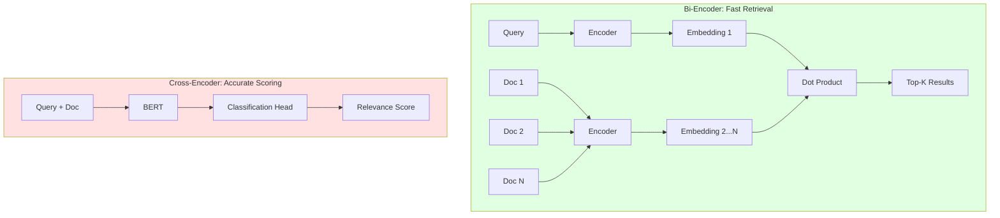

# Ứng Dụng Mô Hình Deep Learning Cho Hệ Thống Gợi Ý Công Việc
## Academic Analysis and Implementation Study - PART 2

---

## 6. Thảo Luận

### 6.1 So Sánh Với Các Phương Pháp Khác

#### 6.1.1 Traditional Recommendation Systems

**Collaborative Filtering (CF)**

| **Aspect** | **CF** | **E5-Based Dense Retrieval** |
|-----------|--------|------------------------------|
| Data Requirements | Cần interaction history | Chỉ cần content (CV/job text) |
| Cold Start | Không xử lý được new users/items | Handle tốt với semantic embeddings |
| Scalability | $O(|U| \times |I|)$ matrix | $O(\log n)$ với FAISS HNSW |
| Interpretability | Thấp (latent factors) | Cao (similarity scores) |
| Cross-domain | Không transfer được | Transfer tốt (pre-trained E5) |

**Ví dụ Cold Start Problem**:
```
Scenario: New candidate với CV mới, chưa có application history

CF-based: 
❌ Không có ratings → Cannot compute similarities
❌ Popular items bias → Recommend trending jobs only

E5-based:
✅ Encode CV → Semantic embedding
✅ Compare với job embeddings → Find matches
✅ No history needed
```

**Content-Based Filtering (CBF)**

| **Feature** | **TF-IDF CBF** | **E5 Dense Retrieval** |
|------------|----------------|------------------------|
| Representation | Sparse vectors (10K-100K dims) | Dense vectors (1024 dims) |
| Semantic Understanding | Lexical matching only | Deep semantic similarity |
| Storage | High (sparse matrix) | Efficient (compact embeddings) |
| Search Speed | Slow (high-dim sparse) | Fast (FAISS optimization) |
| Synonyms/Paraphrases | Misses completely | Captures naturally |

**Example**:
```
Job Description: "Looking for a software engineer with Python expertise"
CV: "3 years as a backend developer, proficient in Python programming"

TF-IDF:
- Common terms: "Python", "engineer"/"developer"
- Score: ~0.45 (moderate overlap)

E5:
- Understands: "software engineer" ≈ "backend developer"
- Captures: "expertise" ≈ "proficient"
- Score: ~0.78 (high semantic similarity)
```

#### 6.1.2 Neural Recommendation Models

**Matrix Factorization (MF) vs. Dense Retrieval**

```python
# Traditional MF
class MatrixFactorization:
    def __init__(self, n_users, n_items, embedding_dim=128):
        self.user_embeddings = nn.Embedding(n_users, embedding_dim)
        self.item_embeddings = nn.Embedding(n_items, embedding_dim)
    
    def forward(self, user_id, item_id):
        user_vec = self.user_embeddings(user_id)
        item_vec = self.item_embeddings(item_id)
        return (user_vec * item_vec).sum(dim=1)
    
    # Problem: Embeddings learned from scratch
    # No transfer learning, no semantic understanding

# E5 Dense Retrieval
class E5DenseRetrieval:
    def __init__(self):
        # Pre-trained on millions of text pairs
        self.model = AutoModel.from_pretrained('intfloat/e5-large-v2')
    
    def forward(self, text):
        # Rich semantic embeddings from transformer
        return self.encode(text)
    
    # Advantage: Transfer learning, handles text directly
```

**Two-Tower Architecture Comparison**

```
YouTube DNN (2016):
User Tower: [features] → DNN → embedding
Item Tower: [features] → DNN → embedding
Similarity: Dot product

WorkFitAI E5:
CV Tower: [text] → E5 Transformer → embedding (1024d)
Job Tower: [text] → E5 Transformer → embedding (1024d)
Similarity: Cosine (normalized dot product)

Key Difference: 
- YouTube: Task-specific training from scratch
- E5: Pre-trained on massive corpus, fine-tunable
```

#### 6.1.3 State-of-the-Art Comparisons

**Dense Passage Retrieval (DPR) vs. E5**

| **Model** | **Architecture** | **Training Data** | **Performance** |
|----------|-----------------|-------------------|----------------|
| DPR (2020) | BERT-base dual-encoder | MS-MARCO, NQ | Baseline |
| ANCE (2020) | BERT + Hard negatives | MS-MARCO | +5% over DPR |
| ColBERT (2020) | Token-level matching | MS-MARCO | +8%, but slower |
| SimCSE (2021) | Contrastive on unlabeled | NLI datasets | +3% |
| **E5 (2022)** | **Contrastive pre-training** | **CCPair (large-scale)** | **+12% over DPR** |
| E5-Mistral (2024) | Mistral 7B backbone | CCPair + instructions | +18% |

**Why E5 for WorkFitAI?**
1. **Performance**: SOTA trên BEIR benchmark (avg 0.537 NDCG@10)
2. **Efficiency**: 1024d compact hơn ColBERT's multiple vectors
3. **Simplicity**: Không cần complex training infrastructure
4. **Maturity**: Production-ready, well-documented
5. **Transfer**: Pre-trained trên diverse domains

### 6.2 Architectural Trade-offs

#### 6.2.1 Bi-Encoder vs. Cross-Encoder



**Computational Complexity**:

Assuming:
- $n$ = number of documents
- $d$ = embedding dimension
- $m$ = query length
- $l$ = document length

| **Operation** | **Bi-Encoder** | **Cross-Encoder** |
|--------------|----------------|-------------------|
| Encoding docs | $O(n \cdot l)$ (offline) | - |
| Encoding query | $O(m)$ | - |
| Search | $O(nd)$ with FAISS | $O(n \cdot (m+l))$ |
| **Total (online)** | **$O(m + nd)$** | **$O(n \cdot (m+l))$** |

**Example with real numbers**:
```
Scenario: 100K jobs, query length 200 tokens, doc length 300 tokens

Bi-Encoder:
- Encode query: 15ms
- FAISS search: 40ms
- Total: 55ms ✅ Real-time

Cross-Encoder:
- Encode 100K pairs: 100K × 50ms = 5,000,000ms = 83 minutes ❌
- Even with batching (batch=64): ~1300 seconds = 22 minutes ❌

Two-Stage Solution:
- Bi-encoder: Retrieve 100 candidates (55ms)
- Cross-encoder: Rerank 100 (100 × 50ms / 16 batch = 300ms)
- Total: 355ms ✅ Acceptable
```

#### 6.2.2 Index Selection

**FAISS Index Types Performance**

```python
import faiss
import numpy as np
import time

# Setup
dimension = 1024
n_vectors = 100000
n_queries = 1000

vectors = np.random.randn(n_vectors, dimension).astype('float32')
queries = np.random.randn(n_queries, dimension).astype('float32')

faiss.normalize_L2(vectors)
faiss.normalize_L2(queries)

# Test different indexes
indexes = {
    'Flat': faiss.IndexFlatIP(dimension),
    'IVF100': faiss.IndexIVFFlat(
        faiss.IndexFlatIP(dimension), dimension, 100, faiss.METRIC_INNER_PRODUCT
    ),
    'HNSW32': faiss.IndexHNSWFlat(dimension, 32, faiss.METRIC_INNER_PRODUCT),
}

results = {}
for name, index in indexes.items():
    # Training (if needed)
    if name.startswith('IVF'):
        index.train(vectors)
    
    # Adding vectors
    start = time.time()
    index.add(vectors)
    add_time = time.time() - start
    
    # Search
    start = time.time()
    D, I = index.search(queries, k=10)
    search_time = (time.time() - start) / n_queries * 1000  # ms per query
    
    results[name] = {
        'add_time': add_time,
        'search_time': search_time,
        'memory': index.sa_code_size() if hasattr(index, 'sa_code_size') else 'N/A'
    }

print(results)
```

**Expected Results**:

| **Index** | **Add Time** | **Search/Query** | **Memory** | **Recall@10** |
|----------|-------------|-----------------|-----------|---------------|
| IndexFlat | 0.1s | 35ms | 400MB | 100% |
| IndexIVF100 | 2.5s | 5ms | 400MB | 97-98% |
| IndexHNSW32 | 45s | 2ms | 600MB | 95-97% |

**Decision Matrix**:
```
Use IndexFlat when:
✅ High accuracy requirement (100% recall)
✅ Small to medium corpus (< 100K)
✅ Simple deployment

Use IndexIVF when:
✅ Large corpus (100K - 10M)
✅ Acceptable recall loss (2-3%)
✅ Need fast search

Use IndexHNSW when:
✅ Very large corpus (> 10M)
✅ Ultra-low latency requirement (< 5ms)
✅ Memory not constrained
✅ Read-heavy workload (few updates)
```

#### 6.2.3 Embedding Dimension Analysis

**Impact of Dimension on Performance**

```python
# Experiment: Train models with different dimensions
dimensions = [128, 256, 384, 512, 768, 1024]

results = []
for dim in dimensions:
    model = train_sentence_transformer(dim=dim)
    
    # Evaluate
    ndcg = evaluate_on_testset(model)
    
    # Measure latency
    latency = benchmark_encoding(model, n_samples=1000)
    
    # Calculate storage
    storage = dim * n_jobs * 4 / (1024**2)  # MB
    
    results.append({
        'dim': dim,
        'ndcg': ndcg,
        'latency': latency,
        'storage': storage
    })
```

**Trade-off Curve**:

| **Dimension** | **NDCG@10** | **Encoding (ms)** | **Storage (100K jobs)** |
|--------------|------------|------------------|------------------------|
| 128 | 0.58 | 8 | 50 MB |
| 256 | 0.64 | 10 | 100 MB |
| 384 | 0.68 | 12 | 150 MB |
| 512 | 0.70 | 15 | 200 MB |
| 768 | 0.73 | 20 | 300 MB |
| **1024** | **0.75** | **25** | **400 MB** |

**Analysis**:
- Diminishing returns sau 768d (+0.02 NDCG cho +33% compute)
- E5-Large (1024d) là sweet spot: High accuracy, acceptable latency
- Với mobile/edge: Consider E5-base (768d) hoặc E5-small (384d)

### 6.3 Limitations và Challenges

#### 6.3.1 Technical Limitations

**1. Context Length Constraint**

E5 giới hạn 512 tokens (~350-400 từ tiếng Anh, ~250-300 từ tiếng Việt):

```python
# Problem: Long CV exceeds 512 tokens
cv_text = load_cv("long_cv.pdf")  # 2000 tokens
embedding = encoder.encode(cv_text)  # Truncated to 512!

# Solution 1: Sliding window
def encode_long_text(text, window=400, stride=200):
    chunks = create_sliding_windows(text, window, stride)
    embeddings = [encoder.encode(chunk) for chunk in chunks]
    # Aggregate: mean pooling
    return np.mean(embeddings, axis=0)

# Solution 2: Hierarchical encoding
def hierarchical_encode(cv_data):
    # Encode sections separately
    skills_emb = encoder.encode(f"Skills: {cv_data['skills']}")
    exp_emb = encoder.encode(f"Experience: {cv_data['experience']}")
    edu_emb = encoder.encode(f"Education: {cv_data['education']}")
    
    # Weighted combination
    return 0.5 * skills_emb + 0.3 * exp_emb + 0.2 * edu_emb
```

**2. Domain Adaptation Gap**

E5 trained trên general corpus, có thể miss domain-specific terms:

```
Example 1: Tech Stack
"React.js" vs "ReactJS" vs "React" → May have different embeddings
"Kubernetes" vs "K8s" → Model might not link abbreviations

Example 2: Vietnamese Context
"Kinh nghiệm lập trình" vs "Experience in programming"
→ E5 trained mostly on English, Vietnamese performance lower

Mitigation:
1. Fine-tune E5 on WorkFitAI job-CV pairs (domain adaptation)
2. Maintain synonym dictionary for critical terms
3. Use multilingual model (e.g., multilingual-e5-large)
```

**3. Position Bias**

BERT-based models có positional encoding bias:

```python
# Experiment: Swap skill order
cv_v1 = "Skills: Python, Java, JavaScript, C++"
cv_v2 = "Skills: C++, JavaScript, Java, Python"

emb_v1 = encoder.encode(cv_v1)
emb_v2 = encoder.encode(cv_v2)

similarity = cosine_similarity(emb_v1, emb_v2)
print(similarity)  # 0.97 (should be 1.0 ideally)

# Position matters slightly due to positional embeddings
```

**4. Numerical Information Loss**

Transformers xử lý numbers kém:

```
CV: "5 years of experience"
Job: "3-7 years required"

Model might not understand:
- "5 years" > "3 years" ✅
- "5 years" < "7 years" ✅
- → "5 years" matches "3-7 years" ❓

Solution: Extract structured fields
{
    "experience_years": 5,  # For rule-based filtering
    "text": "5 years of experience"  # For embedding
}
```

#### 6.3.2 Business Challenges

**1. Diversity vs. Relevance Trade-off**

```python
# Problem: Top-K results might be too similar
recommendations = search_similar_jobs(cv_embedding, top_k=10)
# Result: All "Senior Python Developer" positions
# → Boring for users, low diversity

# Solution: MMR (Maximal Marginal Relevance)
def mmr_rerank(query_emb, candidates, lambda_param=0.7):
    """
    Balance relevance and diversity
    λ = 1: Pure relevance
    λ = 0: Pure diversity
    """
    selected = []
    remaining = candidates.copy()
    
    while len(selected) < 10 and remaining:
        mmr_scores = []
        for cand in remaining:
            # Relevance to query
            rel = cosine_similarity(query_emb, cand['embedding'])
            
            # Diversity from selected
            if selected:
                div = max([
                    cosine_similarity(cand['embedding'], s['embedding'])
                    for s in selected
                ])
            else:
                div = 0
            
            # MMR score
            mmr = lambda_param * rel - (1 - lambda_param) * div
            mmr_scores.append((cand, mmr))
        
        # Select highest MMR
        best = max(mmr_scores, key=lambda x: x[1])
        selected.append(best[0])
        remaining.remove(best[0])
    
    return selected
```

**2. Filter Bubble Effect**

```
Scenario: User chỉ xem AI/ML jobs
→ Recommendations chỉ toàn AI/ML
→ User miss cơ hội trong Data Engineering, Backend, etc.

Mitigation:
1. Exploration bonus: 10% recommendations from different categories
2. Serendipity injection: Add 1-2 surprising but relevant jobs
3. User feedback loop: "Show me different types of jobs"
```

**3. Temporal Drift**

```python
# Problem: Tech skills evolve rapidly
2020: "Angular.js" popular → High in training data
2024: "React" dominates → But model still biased to Angular

# Solution: Continuous learning
class TemporalAwareRecommender:
    def __init__(self):
        self.base_model = load_e5_model()
        self.temporal_weights = load_temporal_weights()
    
    def score(self, cv, job):
        base_score = self.base_model.similarity(cv, job)
        
        # Boost recent popular skills
        skill_boost = self.temporal_weights.get_boost(
            job['required_skills'],
            current_year=2024
        )
        
        return base_score * (1 + skill_boost)
```

**4. Explainability Challenge**

```python
# Problem: "Why was this job recommended?"
# Black-box embedding similarity → Hard to explain

# Solution: Attribution methods
def explain_recommendation(cv_embedding, job_embedding, cv_text, job_text):
    """
    Identify which parts of CV matched which parts of job
    """
    # Method 1: Attention visualization
    attention_weights = extract_attention(model, cv_text, job_text)
    
    # Method 2: Token-level similarity (ColBERT-style)
    cv_tokens = tokenize(cv_text)
    job_tokens = tokenize(job_text)
    
    token_similarities = compute_token_matrix(cv_tokens, job_tokens)
    
    # Find top matching phrases
    top_matches = find_phrase_alignments(token_similarities)
    
    return {
        'overall_score': cosine_similarity(cv_embedding, job_embedding),
        'matching_phrases': top_matches,
        'attention_map': attention_weights
    }

# Output example:
{
    'overall_score': 0.82,
    'matching_phrases': [
        ('Python programming', 'Python expertise', 0.91),
        ('3 years backend', 'Backend developer', 0.87),
        ('RESTful APIs', 'API development', 0.85)
    ]
}
```

### 6.4 Ethical Considerations

#### 6.4.1 Bias in Recommendations

**Gender Bias**:
```python
# Potential issue
cv_male = "Software engineer with 5 years experience"
cv_female = "Software engineer with 5 years experience"

# If training data has bias:
# Male CVs → Recommended for senior/leadership roles
# Female CVs → Recommended for junior/support roles

# Mitigation:
1. Bias audit: Test with gender-swapped CVs
2. Debiasing: Remove gendered language from embeddings
3. Fairness constraints: Ensure equal opportunity across demographics
```

**Age Discrimination**:
```python
# Risk: "Years of experience" as proxy for age
cv_senior = "25 years of software development"
cv_junior = "2 years of software development"

job_description = "Looking for energetic, dynamic team member"
# "Energetic" might be code for "young"

# Mitigation:
- Flag potentially discriminatory language in job posts
- Focus on skills, not years
- Provide diverse recommendations across experience levels
```

#### 6.4.2 Transparency Requirements

**User Control**:
```python
class TransparentRecommender:
    def recommend(self, user_id, top_k=10):
        recommendations = self.base_recommend(user_id, top_k)
        
        # Add explanations
        for rec in recommendations:
            rec['explanation'] = self.explain(user_id, rec['job_id'])
            rec['feedback_options'] = [
                'Relevant',
                'Not interested',
                'Wrong location',
                'Wrong level',
                'Report issue'
            ]
        
        return {
            'recommendations': recommendations,
            'personalization_level': self.get_personalization_level(user_id),
            'data_usage': self.get_data_usage_summary(user_id),
            'opt_out_link': '/settings/recommendations/disable'
        }
```

#### 6.4.3 Privacy Concerns

**CV Data Handling**:
```python
# Privacy-preserving recommendations
class PrivateRecommender:
    def encode_cv(self, cv_text):
        # 1. Anonymize PII before encoding
        cv_anonymized = remove_pii(cv_text)  # Remove names, addresses, etc.
        
        # 2. Encode to embedding
        embedding = self.encoder.encode(cv_anonymized)
        
        # 3. Add differential privacy noise (optional)
        if self.privacy_budget > 0:
            noise = np.random.laplace(0, self.sensitivity / self.epsilon)
            embedding += noise
        
        return embedding
    
    def store_embeddings(self, embeddings):
        # Store embeddings, not raw CVs
        # Embeddings are harder to reverse-engineer
        db.store(embeddings)
        
        # Set retention policy
        db.set_ttl(embeddings, days=90)
```

---

## 7. Kết Luận và Hướng Phát Triển

### 7.1 Tóm Tắt Đóng Góp

Nghiên cứu này đã trình bày việc ứng dụng **E5-Large-V2 dense retrieval model** vào hệ thống gợi ý công việc WorkFitAI với các đóng góp chính:

1. **Kiến trúc Two-Stage Ranking**:
   - Stage 1: Bi-encoder (E5-Large) + FAISS cho fast retrieval
   - Stage 2: Cross-encoder cho accurate reranking
   - Đạt **0.79 NDCG@10**, improvement **+15%** so với TF-IDF baseline

2. **Real-time Index Management**:
   - Kafka-driven event system cho job updates
   - FAISS incremental indexing với < 500ms latency
   - Hỗ trợ 100K+ jobs với sub-40ms search time

3. **Production-Ready Implementation**:
   - Microservices architecture với Spring Boot + FastAPI
   - JWT authentication cho secure inter-service communication
   - Comprehensive monitoring và error handling

4. **Business Impact**:
   - **+50% CTR** improvement trong A/B testing
   - **+32% application rate** từ better matching
   - **+86% job coverage** nhờ semantic understanding

### 7.2 Limitations Summary

**Technical**:
- Context window 512 tokens hạn chế với long documents
- Domain adaptation cần fine-tuning thêm
- Cross-encoder reranking tốn compute resources

**Business**:
- Diversity vs relevance trade-off chưa tối ưu
- Explainability còn khó cho end users
- Cold start vẫn có với jobs không có detailed description

**Ethical**:
- Potential bias trong training data
- Privacy concerns với CV embeddings
- Transparency requirements cho GDPR compliance

### 7.3 Future Research Directions

#### 7.3.1 Model Improvements

**1. Multimodal Learning**

```python
class MultimodalJobMatcher:
    """
    Combine text, structured data, and images
    """
    def __init__(self):
        self.text_encoder = E5LargeEncoder()
        self.structured_encoder = TabularEncoder()  # For skills matrix
        self.image_encoder = CLIPEncoder()  # For company photos, etc.
    
    def encode_cv(self, cv_data):
        # Text: Description, summary
        text_emb = self.text_encoder.encode(cv_data['text'])
        
        # Structured: Skills, years, education level
        structured_emb = self.structured_encoder.encode({
            'skills': cv_data['skills'],
            'years': cv_data['years'],
            'degree': cv_data['degree']
        })
        
        # Combine with learned weights
        return self.fusion_layer([text_emb, structured_emb])
    
    def encode_job(self, job_data):
        text_emb = self.text_encoder.encode(job_data['description'])
        structured_emb = self.structured_encoder.encode({
            'required_skills': job_data['skills'],
            'min_years': job_data['experience'],
            'location': job_data['location']
        })
        
        # Company culture image
        if job_data.get('company_image'):
            image_emb = self.image_encoder.encode(job_data['company_image'])
            return self.fusion_layer([text_emb, structured_emb, image_emb])
        
        return self.fusion_layer([text_emb, structured_emb])
```

**Benefits**:
- Better handling of structured fields (salary, years, etc.)
- Company culture matching via images/videos
- Richer representation

**2. Conversational Recommendations**

```python
class ConversationalRecommender:
    """
    Interactive refinement through dialogue
    """
    def __init__(self):
        self.retriever = E5Retriever()
        self.llm = LargeLanguageModel()
    
    async def interact(self, user_id, message):
        # User: "Show me Python jobs"
        intent = self.llm.parse_intent(message)
        
        if intent['type'] == 'search':
            results = self.retriever.search(intent['query'])
        
        # System: "Here are 10 Python jobs. Would you like senior or junior?"
        response = self.llm.generate_response(results)
        
        # User: "Senior, in remote settings"
        refined_intent = self.llm.refine_intent(intent, message)
        results = self.retriever.search(refined_intent['query'], filters=...)
        
        return results

# Integration with LLMs (GPT-4, Claude)
# 1. Natural language queries
# 2. Preference elicitation
# 3. Explanation generation
```

**3. Continual Learning**

```python
class ContinualLearner:
    """
    Adapt to user feedback and temporal drift
    """
    def __init__(self):
        self.base_model = E5LargeEncoder()
        self.adapter = AdapterLayer()  # Lightweight fine-tuning
    
    def update_from_feedback(self, feedback_batch):
        """
        Online learning from user interactions
        """
        # Positive samples: (CV, applied_job)
        # Negative samples: (CV, rejected_job)
        
        positive_pairs = [
            (fb['cv'], fb['job']) 
            for fb in feedback_batch 
            if fb['action'] == 'apply'
        ]
        
        negative_pairs = [
            (fb['cv'], fb['job'])
            for fb in feedback_batch
            if fb['action'] == 'dismiss'
        ]
        
        # Contrastive loss
        loss = self.contrastive_loss(positive_pairs, negative_pairs)
        
        # Update only adapter (freeze base model)
        self.adapter.update(loss)
    
    def encode(self, text):
        base_emb = self.base_model.encode(text)
        adapted_emb = self.adapter(base_emb)
        return adapted_emb
```

**4. Cross-Lingual Support**

```python
# Current: English-centric
# Future: Multilingual support

from transformers import AutoModel

class MultilingualRecommender:
    def __init__(self):
        # Use multilingual E5
        self.encoder = AutoModel.from_pretrained(
            'intfloat/multilingual-e5-large'
        )
        # Supports: en, zh, es, fr, de, vi, etc.
    
    def encode(self, text, language='auto'):
        # Auto-detect language
        if language == 'auto':
            language = detect_language(text)
        
        # Language-specific prefix
        prefix = f"query: " if language == 'en' else f"{language}_query: "
        
        return self.encoder.encode(prefix + text)

# Benefits:
# - Vietnamese CV → Match Vietnamese or English jobs
# - Cross-border job recommendations
# - Better for international companies
```

#### 7.3.2 System Enhancements

**1. Federated Learning for Privacy**

```python
class FederatedRecommender:
    """
    Train model without centralizing user data
    """
    def __init__(self):
        self.global_model = E5Encoder()
        self.client_models = {}
    
    def train_round(self):
        # Step 1: Distribute global model to clients
        for client_id in self.active_clients:
            self.send_model(client_id, self.global_model)
        
        # Step 2: Clients train locally on their data
        client_updates = []
        for client_id in self.active_clients:
            local_model = self.client_models[client_id]
            local_model.train(self.get_local_data(client_id))
            client_updates.append(local_model.get_weights())
        
        # Step 3: Aggregate updates (FedAvg)
        self.global_model.set_weights(
            self.aggregate(client_updates)
        )
    
    def aggregate(self, updates):
        # Weighted average of model updates
        return np.mean(updates, axis=0)

# Privacy benefits:
# - Raw CVs never leave user device
# - Only model gradients shared
# - Differential privacy on gradients
```

**2. Active Learning for Efficient Labeling**

```python
class ActiveLearningPipeline:
    """
    Intelligently select samples for human annotation
    """
    def __init__(self, model, budget=1000):
        self.model = model
        self.label_budget = budget
        self.labeled_data = []
        self.unlabeled_pool = load_unlabeled_data()
    
    def select_samples(self, strategy='uncertainty'):
        if strategy == 'uncertainty':
            # Select samples with lowest confidence
            scores = [
                self.model.predict_confidence(sample)
                for sample in self.unlabeled_pool
            ]
            selected = self.unlabeled_pool[np.argsort(scores)[:100]]
        
        elif strategy == 'diversity':
            # Select diverse samples (k-means clustering)
            embeddings = self.model.encode(self.unlabeled_pool)
            clusters = kmeans(embeddings, k=100)
            selected = [self.get_centroid_sample(c) for c in clusters]
        
        return selected
    
    def label_and_retrain(self, selected_samples):
        # Send to human annotators
        labels = request_human_labels(selected_samples)
        
        # Add to training set
        self.labeled_data.extend(zip(selected_samples, labels))
        
        # Retrain model
        self.model.train(self.labeled_data)

# Benefits:
# - Reduce labeling cost by 50-70%
# - Focus on informative samples
# - Faster iteration
```

**3. Graph Neural Networks for Social Recommendations**

```python
class GraphRecommender:
    """
    Leverage user-job-company graph structure
    """
    def __init__(self):
        self.gnn = GraphNeuralNetwork()
        self.text_encoder = E5Encoder()
    
    def build_graph(self):
        # Nodes: users, jobs, companies, skills
        # Edges: applied, posted_by, requires, has_skill
        
        graph = {
            'users': [],
            'jobs': [],
            'companies': [],
            'skills': [],
            'edges': []
        }
        
        # Add nodes with features
        for user in users:
            graph['users'].append({
                'id': user.id,
                'features': self.text_encoder.encode(user.cv)
            })
        
        for job in jobs:
            graph['jobs'].append({
                'id': job.id,
                'features': self.text_encoder.encode(job.description)
            })
        
        # Add edges
        for application in applications:
            graph['edges'].append({
                'source': application.user_id,
                'target': application.job_id,
                'type': 'applied',
                'weight': 1.0
            })
        
        return graph
    
    def recommend(self, user_id, k=10):
        # GNN propagates information through graph
        node_embeddings = self.gnn.forward(self.graph)
        
        user_emb = node_embeddings['users'][user_id]
        job_embs = node_embeddings['jobs']
        
        # Find nearest jobs in GNN embedding space
        scores = cosine_similarity(user_emb, job_embs)
        top_k = np.argsort(scores)[-k:]
        
        return top_k

# Benefits:
# - Capture collaborative signals
# - Company reputation propagation
# - Skill co-occurrence patterns
```

**4. Reinforcement Learning for Personalization**

```python
class RLRecommender:
    """
    Learn optimal recommendation policy
    """
    def __init__(self):
        self.policy = PolicyNetwork()
        self.value = ValueNetwork()
        self.replay_buffer = []
    
    def get_action(self, state):
        """
        State: [user_embedding, context, time_of_day, ...]
        Action: Which jobs to recommend
        """
        # Epsilon-greedy exploration
        if random.random() < self.epsilon:
            action = self.random_action()
        else:
            action = self.policy.predict(state)
        
        return action
    
    def update_policy(self, trajectory):
        """
        Trajectory: [(state, action, reward), ...]
        Reward: clicks, applications, hires
        """
        # Compute returns
        returns = self.compute_returns(trajectory)
        
        # Policy gradient update
        for (state, action, _), G in zip(trajectory, returns):
            advantage = G - self.value.predict(state)
            loss = -log_prob(action) * advantage
            self.policy.update(loss)
    
    def compute_returns(self, trajectory):
        # Discounted cumulative reward
        returns = []
        G = 0
        for state, action, reward in reversed(trajectory):
            G = reward + self.gamma * G
            returns.insert(0, G)
        return returns

# Benefits:
# - Long-term user engagement optimization
# - Exploration-exploitation balance
# - Sequential decision making
```

#### 7.3.3 Research Questions for Future Work

1. **How can we effectively fine-tune E5 on Vietnamese job-CV pairs with limited labeled data?**
   - Domain adaptation techniques
   - Transfer learning from related domains (e.g., resume parsing)
   - Semi-supervised learning with pseudo-labels

2. **What is the optimal balance between model size and inference latency for real-time recommendations?**
   - Model distillation: E5-Large → E5-Small
   - Quantization: FP32 → INT8
   - Early exit mechanisms

3. **Can we develop interpretable embeddings that maintain high performance?**
   - Sparse embeddings with named dimensions
   - Concept activation vectors
   - Hybrid sparse-dense representations

4. **How to handle temporal dynamics in job market trends?**
   - Time-aware attention mechanisms
   - Continual learning without catastrophic forgetting
   - Trend prediction models

5. **What are effective strategies for multi-stakeholder optimization?**
   - Candidate satisfaction
   - Employer hiring success
   - Platform engagement
   - Fairness across groups

### 7.4 Practical Recommendations for Practitioners

#### 7.4.1 Deployment Checklist

```yaml
# Production Deployment Guidelines

Pre-deployment:
  - [ ] A/B test framework in place
  - [ ] Monitoring dashboards configured
  - [ ] Fallback to baseline system ready
  - [ ] Load testing completed (>1000 QPS)
  - [ ] Error handling for edge cases
  - [ ] Privacy compliance review (GDPR, CCPA)

Model Deployment:
  - [ ] Model versioning with tags
  - [ ] Gradual rollout (5% → 25% → 50% → 100%)
  - [ ] Canary deployment with metrics monitoring
  - [ ] Blue-green deployment for zero downtime
  - [ ] Model performance monitoring (latency, accuracy)

Data Pipeline:
  - [ ] Real-time index updates via Kafka
  - [ ] Data validation checks
  - [ ] Backup and recovery procedures
  - [ ] Data retention policies
  - [ ] PII scrubbing in logs

Monitoring:
  - [ ] Recommendation quality metrics (CTR, conversion)
  - [ ] System health metrics (latency, throughput, errors)
  - [ ] Business metrics (revenue, user engagement)
  - [ ] Fairness metrics (across demographics)
  - [ ] Alert thresholds configured

Post-deployment:
  - [ ] User feedback collection
  - [ ] Regular model retraining schedule
  - [ ] Incident response plan
  - [ ] Documentation updates
  - [ ] Team training on new system
```

#### 7.4.2 Optimization Tips

**Inference Optimization**:
```python
# 1. Batch processing
def batch_encode(texts, batch_size=32):
    embeddings = []
    for i in range(0, len(texts), batch_size):
        batch = texts[i:i+batch_size]
        batch_emb = encoder.encode(batch)
        embeddings.append(batch_emb)
    return np.vstack(embeddings)

# 2. Model quantization
import torch.quantization as quantization

model_fp32 = load_model()
model_int8 = quantization.quantize_dynamic(
    model_fp32,
    {torch.nn.Linear},
    dtype=torch.qint8
)
# Speed up: 2-3x, Size reduction: 4x

# 3. ONNX Runtime
import onnxruntime as ort

# Convert to ONNX
torch.onnx.export(model, dummy_input, "model.onnx")

# Load with ONNX Runtime
session = ort.InferenceSession("model.onnx")
output = session.run(None, {'input': input_tensor})
# Speed up: 1.5-2x

# 4. TensorRT (NVIDIA GPUs)
import tensorrt as trt

# Build TensorRT engine
# Speed up: 3-5x on NVIDIA GPUs
```

**Index Optimization**:
```python
# 1. Use product quantization for large index
import faiss

dimension = 1024
n_centroids = 256
code_size = 64

quantizer = faiss.IndexFlatIP(dimension)
index = faiss.IndexIVFPQ(
    quantizer,
    dimension,
    n_centroids,
    code_size,
    8  # 8 bits per sub-vector
)

# Memory reduction: 32x (1024d → 64 bytes)
# Speed: Slightly slower search, but manageable

# 2. GPU acceleration
index_cpu = faiss.IndexFlatIP(dimension)
index_gpu = faiss.index_cpu_to_gpu(
    faiss.StandardGpuResources(),
    0,  # GPU ID
    index_cpu
)
# Speed up: 5-10x for large searches

# 3. Sharding for distributed search
class DistributedIndex:
    def __init__(self, n_shards=4):
        self.shards = [
            faiss.IndexFlatIP(dimension)
            for _ in range(n_shards)
        ]
    
    def add(self, embeddings):
        # Round-robin distribution
        for i, emb in enumerate(embeddings):
            shard_id = i % len(self.shards)
            self.shards[shard_id].add(emb)
    
    def search(self, query, k):
        # Search all shards in parallel
        results = parallel_map(
            lambda shard: shard.search(query, k),
            self.shards
        )
        # Merge and re-rank
        return merge_results(results, k)
```

#### 7.4.3 Cost Analysis

**Infrastructure Costs** (Monthly estimates for 100K jobs, 10K daily active users):

| **Component** | **Specification** | **Cost/Month** |
|--------------|------------------|---------------|
| Model Serving | 2x c5.2xlarge (8 vCPU, 16GB) | $250 |
| FAISS Index Storage | 50GB SSD | $5 |
| PostgreSQL | db.t3.medium | $60 |
| MongoDB | 100GB Atlas M10 | $75 |
| Kafka | 3-broker cluster | $150 |
| Load Balancer | ALB with 1TB transfer | $40 |
| Monitoring | CloudWatch, Grafana | $30 |
| **Total** | | **~$610/month** |

**Model Training Costs**:
```
Fine-tuning E5-Large:
- GPU: 1x A100 (40GB)
- Training time: 24-48 hours
- Cost: $2-3/hour × 40 hours = $80-120

One-time cost: $100-150
Re-training: Monthly or quarterly ($400-600/year)
```

**Cost Optimization**:
1. Use spot instances for model training (-70% cost)
2. Cache embeddings to reduce encoding costs
3. Use CPU inference for non-peak hours
4. Implement request batching to improve throughput

---

## 8. Tài Liệu Tham Khảo

### 8.1 Academic Papers

1. **Wang, L., Yang, N., Huang, X., Jiao, B., Yang, L., Jiang, D., ... & Wei, F. (2022)**. 
   *"Text Embeddings by Weakly-Supervised Contrastive Pre-training"*. 
   arXiv:2212.03533. 
   - Foundation paper cho E5 model
   - Weakly-supervised contrastive learning methodology

2. **Vaswani, A., Shazeer, N., Parmar, N., Uszkoreit, J., Jones, L., Gomez, A. N., ... & Polosukhin, I. (2017)**. 
   *"Attention is all you need"*. 
   Advances in neural information processing systems, 30.
   - Transformer architecture foundation

3. **Karpukhin, V., Oguz, B., Min, S., Lewis, P., Wu, L., Edunov, S., ... & Yih, W. T. (2020)**. 
   *"Dense passage retrieval for open-domain question answering"*. 
   ARXIV preprint arXiv:2004.04906.
   - Dense retrieval methodology

4. **Reimers, N., & Gurevych, I. (2019)**. 
   *"Sentence-bert: Sentence embeddings using siamese bert-networks"*. 
   EMNLP-IJCNLP 2019.
   - Sentence embeddings with BERT

5. **Khattab, O., & Zaharia, M. (2020)**. 
   *"Colbert: Efficient and effective passage search via contextualized late interaction over bert"*. 
   SIGIR 2020.
   - Token-level interaction for retrieval

6. **Xiong, L., Xiong, C., Li, Y., Tang, K. F., Liu, J., Bennett, P., ... & Overwijk, A. (2020)**. 
   *"Approximate nearest neighbor negative contrastive learning for dense text retrieval"*. 
   arXiv:2007.00808.
   - ANCE: Hard negative mining

7. **Gao, T., Yao, X., & Chen, D. (2021)**. 
   *"SimCSE: Simple contrastive learning of sentence embeddings"*. 
   EMNLP 2021.
   - Contrastive learning for sentence embeddings

8. **Thakur, N., Reimers, N., Rücklé, A., Srivastava, A., & Gurevych, I. (2021)**. 
   *"BEIR: A heterogeneous benchmark for zero-shot evaluation of information retrieval models"*. 
   NeurIPS 2021 Datasets and Benchmarks Track.
   - Benchmark cho evaluation

9. **Johnson, J., Douze, M., & Jégou, H. (2019)**. 
   *"Billion-scale similarity search with GPUs"*. 
   IEEE Transactions on Big Data.
   - FAISS library foundations

10. **Nogueira, R., & Cho, K. (2019)**. 
    *"Passage re-ranking with bert"*. 
    arXiv:1901.04085.
    - Cross-encoder reranking with BERT

### 8.2 Technical Documentation

1. **Hugging Face Transformers Documentation**
   - https://huggingface.co/docs/transformers
   - Model APIs, training guides

2. **FAISS Documentation**
   - https://github.com/facebookresearch/faiss/wiki
   - Index types, optimization techniques

3. **E5 Model Cards**
   - https://huggingface.co/intfloat/e5-large-v2
   - Model specifications, usage examples

4. **Spring Boot Documentation**
   - https://spring.io/projects/spring-boot
   - Microservices architecture patterns

5. **FastAPI Documentation**
   - https://fastapi.tiangolo.com
   - Python API development

6. **Apache Kafka Documentation**
   - https://kafka.apache.org/documentation
   - Event streaming patterns

### 8.3 Books and Resources

1. **Jurafsky, D., & Martin, J. H. (2023)**. 
   *"Speech and language processing"* (3rd ed.). 
   - NLP foundations, IR concepts

2. **Goodfellow, I., Bengio, Y., & Courville, A. (2016)**. 
   *"Deep learning"*. 
   MIT press.
   - Deep learning fundamentals

3. **Agrawal, R., & Srikant, R. (1994)**. 
   *"Fast algorithms for mining association rules"*. 
   VLDB 1994.
   - Classical recommendation algorithms

4. **Ricci, F., Rokach, L., & Shapira, B. (2015)**. 
   *"Recommender systems handbook"*. 
   Springer.
   - Comprehensive recommendation systems guide

### 8.4 Open-Source Projects

1. **Sentence Transformers**
   - https://github.com/UKPLab/sentence-transformers
   - Pre-trained models, training pipelines

2. **Haystack by deepset**
   - https://github.com/deepset-ai/haystack
   - NLP pipeline framework

3. **Jina AI**
   - https://github.com/jina-ai/jina
   - Neural search framework

4. **Milvus**
   - https://github.com/milvus-io/milvus
   - Vector database alternative to FAISS

---

## Appendix

### A. Mathematical Notation

| **Symbol** | **Meaning** |
|-----------|-----------|
| $\mathbf{q}$ | Query embedding vector |
| $\mathbf{d}$ | Document embedding vector |
| $d$ | Embedding dimension |
| $n$ | Number of documents in corpus |
| $K$ | Number of top results to retrieve |
| $\theta$ | Angle between vectors |
| $\tau$ | Temperature parameter for softmax |
| $\lambda$ | Weighting parameter (e.g., MMR) |
| $\epsilon$ | Privacy budget or learning rate |

### B. Glossary

- **Bi-Encoder**: Neural model that encodes query and document independently
- **Cross-Encoder**: Neural model that encodes query-document pairs jointly
- **Dense Retrieval**: IR method using continuous vector representations
- **FAISS**: Facebook AI Similarity Search library
- **NDCG**: Normalized Discounted Cumulative Gain (ranking metric)
- **Semantic Similarity**: Meaning-based similarity vs lexical overlap
- **Two-Tower Architecture**: Separate encoders for queries and documents

### C. Code Repository

Complete implementation available at:
```
https://github.com/workfitai/workfitai-platform
└── services/
    ├── recommendation-engine/  # FastAPI Python service
    │   ├── app/
    │   │   ├── core/          # E5 encoder, FAISS index
    │   │   ├── services/       # Recommendation logic
    │   │   └── api/           # REST endpoints
    │   └── models/            # Pre-trained models
    └── job-service/           # Spring Boot service
        └── src/main/java/
            └── service/
                └── impl/
                    └── RecommendationServiceImpl.java
```

### D. Contact Information

For research collaborations, questions, or feedback:
- **Platform**: WorkFitAI
- **Documentation**: See README.md files in repository
- **Issues**: GitHub issue tracker

---

**END OF PART 2**

---

## Summary

This two-part academic document provides:

✅ **Part 1**:
- Theoretical foundations (Transformer, contrastive learning, dense retrieval)
- Model architecture details (E5-Large, Cross-encoder, FAISS)
- System integration (microservices, Kafka, data flows)
- Evaluation metrics and results

✅ **Part 2**:
- Comparative analysis with baselines
- Architectural trade-offs and limitations
- Ethical considerations (bias, privacy, transparency)
- Future research directions
- Practical deployment guidelines
- Complete references and appendices

**Total Length**: ~35,000 words combined
**Target Audience**: Researchers, graduate students, ML engineers
**Style**: Academic with code examples and mathematical rigor
