# WorkFitAI Recommendation Engine

AI-powered job recommendation system using **E5-Large bi-encoder** (1024d) and **FAISS** vector search with optional cross-encoder reranking for maximum accuracy.

## 📑 Table of Contents

- [Architecture Overview](#architecture-overview)
- [Data Flow & Communication](#data-flow--communication)
- [API Endpoints](#api-endpoints)
- [Setup & Installation](#setup--installation)
- [Configuration](#configuration)
- [Development Guide](#development-guide)
- [Troubleshooting](#troubleshooting)

---

## 🏗️ Architecture Overview

### Technology Stack

| Component | Technology | Purpose |
|-----------|-----------|---------|
| **Framework** | FastAPI 0.104.1 | High-performance async REST API |
| **ML Model** | E5-Large (intfloat/e5-large-v2) | 1024-dim text embeddings |
| **Vector DB** | FAISS (IndexFlatIP) | Cosine similarity search |
| **Reranking** | Cross-encoder (custom trained) | 2-stage retrieval pipeline |
| **Message Queue** | Kafka 2.5.0 | Real-time job event streaming |
| **Config** | Vault + .env.local | Secret management |

### System Architecture

```mermaid
graph TB
    subgraph "Client Layer"
        USER[👤 User/Candidate]
        API_GW[🌐 API Gateway :9085]
    end
    
    subgraph "Service Layer"
        JOB_SVC[📋 Job Service :9082]
        CV_SVC[📄 CV Service :9083]
        REC_ENG[🤖 Recommendation Engine :8000]
    end
    
    subgraph "Data Layer"
        KAFKA[📨 Kafka :9092]
        FAISS[(🔍 FAISS Index<br/>1024d vectors)]
        POSTGRES[(🐘 PostgreSQL<br/>Job data)]
        MINIO[(📦 MinIO<br/>CV files)]
    end
    
    USER -->|GET /job/recommendations/for-me| API_GW
    API_GW --> JOB_SVC
    JOB_SVC -->|Fetch CV profile| CV_SVC
    JOB_SVC -->|POST /by-profile| REC_ENG
    REC_ENG --> FAISS
    REC_ENG -->|jobIds| JOB_SVC
    JOB_SVC --> POSTGRES
    JOB_SVC -->|recommendations + full job data| USER
    
    KAFKA -->|job.created<br/>job.updated<br/>job.deleted| REC_ENG
    REC_ENG -.->|Sync on startup| JOB_SVC
    
    style REC_ENG fill:#e1f5ff,stroke:#01579b
    style FAISS fill:#fff9c4,stroke:#f57f17
```



---

## 🔄 Data Flow & Communication

### 1. Job Recommendation Flow (CV-based)


### 2. Similar Jobs Flow


### 3. Real-time Job Sync via Kafka


### 4. Initial Sync on Startup

```mermaid
flowchart TB
    START([🚀 Engine Starts])
    LOAD_MODEL[Load E5-Large Model<br/>1024d embeddings]
    INIT_FAISS[Initialize FAISS<br/>IndexFlatIP]
    CHECK_PERSIST{Persisted index<br/>exists?}
    LOAD_INDEX[Load from disk]
    SYNC_START[Trigger initial sync]
    FETCH_JOBS[GET /job/public/jobs<br/>pagination: 50/page]
    GEN_EMBED[Generate embeddings<br/>batch processing]
    ADD_FAISS[Add vectors to FAISS]
    MORE{More pages?}
    KAFKA_SUB[Subscribe to Kafka topics]
    READY([✅ Ready])
    
    START --> LOAD_MODEL
    LOAD_MODEL --> INIT_FAISS
    INIT_FAISS --> CHECK_PERSIST
    CHECK_PERSIST -->|Yes| LOAD_INDEX
    CHECK_PERSIST -->|No| SYNC_START
    LOAD_INDEX --> KAFKA_SUB
    SYNC_START --> FETCH_JOBS
    FETCH_JOBS --> GEN_EMBED
    GEN_EMBED --> ADD_FAISS
    ADD_FAISS --> MORE
    MORE -->|Yes| FETCH_JOBS
    MORE -->|No| KAFKA_SUB
    KAFKA_SUB --> READY
    
    style START fill:#4caf50
    style READY fill:#4caf50
    style LOAD_MODEL fill:#2196f3
    style INIT_FAISS fill:#ff9800
    style KAFKA_SUB fill:#9c27b0
```



---

## 📡 API Endpoints

### Base URL
- **Local**: `http://localhost:8000`
- **Docker**: `http://recommendation-engine:8000`
- **Via Gateway**: `http://localhost:9085/recommendations` (Job Service proxies)

### 1. Health Check

**Endpoint**: `GET /health`

**Response**:
```json
{
  "status": "healthy",
  "service": "recommendation-engine",
  "version": "1.0.0",
  "timestamp": "2025-12-20T14:30:00Z"
}
```

---

### 2. Recommend by Profile (CV-based)

**Endpoint**: `POST /api/v1/recommendations/by-profile`

**Description**: Get job recommendations based on candidate's CV/profile text using bi-encoder + optional cross-encoder reranking.

**Request Body**:
```json
{
  "profileText": "Senior Java Developer with 5 years experience in Spring Boot, microservices...",
  "topK": 20,
  "filters": {
    "locations": ["Ha Noi City", "Ho Chi Minh City"],
    "experienceLevels": ["SENIOR", "MIDDLE"],
    "employmentTypes": ["FULL_TIME"],
    "minSalary": 1500,
    "maxSalary": 3000
  }
}
```

**Request DTO**:
```python
class RecommendByProfileRequest(BaseModel):
    profileText: str           # CV/profile text (skills, experience, etc.)
    topK: int = 20            # Number of recommendations (1-100)
    filters: Optional[RecommendationFilters] = None

class RecommendationFilters(BaseModel):
    locations: Optional[List[str]] = None
    experienceLevels: Optional[List[str]] = None
    employmentTypes: Optional[List[str]] = None
    minSalary: Optional[float] = None
    maxSalary: Optional[float] = None
```

**Response**:
```json
{
  "success": true,
  "data": {
    "totalResults": 20,
    "recommendations": [
      {
        "jobId": "550e8400-e29b-41d4-a716-446655440000",
        "score": 0.847,
        "rank": 1,
        "biEncoderScore": 0.823,
        "crossEncoderScore": 0.871,
        "title": "Senior Java Developer",
        "company": "TechCorp Vietnam",
        "location": "Ha Noi City",
        "salary": "2000 - 2500 USD",
        "experienceLevel": "SENIOR",
        "jobType": "FULL_TIME",
        "skills": ["Java", "Spring Boot", "Microservices"]
      }
    ],
    "processingTime": "1247ms"
  },
  "message": "Found 20 matching jobs"
}
```

**Response DTO**:
```python
class JobRecommendation(BaseModel):
    jobId: str
    score: float                              # Final score (0-1)
    rank: int
    biEncoderScore: Optional[float] = None    # Bi-encoder similarity
    crossEncoderScore: Optional[float] = None # Cross-encoder score (if enabled)
    title: str
    company: str
    location: str
    salary: Optional[str] = None
    experienceLevel: Optional[str] = None
    jobType: Optional[str] = None
    skills: List[str] = []

class RecommendationData(BaseModel):
    totalResults: int
    recommendations: List[JobRecommendation]
    processingTime: str

class RecommendationResponse(BaseModel):
    success: bool
    data: RecommendationData
    message: str
```

**Pipeline**:
1. **Embedding Generation**: Convert profile text to 1024d vector using E5-Large
2. **FAISS Search**: Retrieve top-K candidates (50 if reranking enabled, else topK)
3. **Filter Application**: Apply location, salary, experience filters
4. **Reranking** (optional): Cross-encoder scores top-50, returns top-N
5. **Return**: Sorted list with scores and metadata

---

### 3. Recommend by Resume (PDF Upload)

**Endpoint**: `POST /api/v1/recommendations/by-resume`

**Description**: Upload PDF resume and get recommendations.

**Request Body**:
```json
{
  "resumeFile": "JVBERi0xLjQKJeLjz9MKMSAwIG9ia...", 
  "topK": 10,
  "filters": {
    "locations": ["Ha Noi City"]
  }
}
```

**Request DTO**:
```python
class RecommendByResumeRequest(BaseModel):
    resumeFile: str  # Base64 encoded PDF
    topK: int = 20
    filters: Optional[RecommendationFilters] = None
```

**Response**: Same as `/by-profile`

**Process**:
1. Decode base64 PDF
2. Parse resume using PyPDF2/pdfplumber
3. Extract text (skills, experience, education)
4. Generate embedding and search

---

### 4. Find Similar Jobs

**Endpoint**: `POST /api/v1/recommendations/similar-jobs`

**Description**: Find jobs similar to a reference job (content-based filtering).

**Request Body**:
```json
{
  "jobId": "550e8400-e29b-41d4-a716-446655440000",
  "topK": 5,
  "excludeSameCompany": false
}
```

**Request DTO**:
```python
class SimilarJobsRequest(BaseModel):
    jobId: str              # Reference job UUID
    topK: int = 10
    excludeSameCompany: bool = False  # Filter out same company
```

**Response**:
```json
{
  "success": true,
  "data": {
    "totalResults": 5,
    "recommendations": [
      {
        "jobId": "660e8400-e29b-41d4-a716-446655440001",
        "score": 0.912,
        "rank": 1,
        "title": "Senior Backend Developer",
        "company": "StartupXYZ"
      }
    ],
    "processingTime": "23ms"
  }
}
```

**Use Cases**:
- "Similar jobs" section on job detail page
- Job recommendations without user profile
- Content-based recommendations for anonymous users

---

### 5. Semantic Search

**Endpoint**: `POST /api/v1/recommendations/search`

**Description**: Search jobs using natural language query.

**Request Body**:
```json
{
  "query": "remote python jobs with machine learning",
  "topK": 15,
  "filters": {
    "employmentTypes": ["REMOTE"]
  }
}
```

**Request DTO**:
```python
class SemanticSearchRequest(BaseModel):
    query: str       # Natural language search query
    topK: int = 20
    filters: Optional[RecommendationFilters] = None
```

**Response**: Same structure as other endpoints

**Features**:
- Semantic understanding (not just keyword matching)
- Handles synonyms (e.g., "ML" = "Machine Learning")
- Context-aware search

---

## 🛠️ Setup & Installation

### Prerequisites

#### macOS / Linux
```bash
# Python 3.10+
python3 --version

# pip
pip3 --version

# Docker (for infrastructure)
docker --version
docker-compose --version
```

#### Windows
```powershell
# Install Python 3.10+ from python.org
python --version

# Install pip
pip --version

# Install Docker Desktop
docker --version
```

---

### 🍎 Setup on macOS / Linux

#### 1. Clone Repository
```bash
cd /path/to/workfitai-platform
cd services/recommendation-engine
```

#### 2. Create Virtual Environment
```bash
python3 -m venv venv
source venv/bin/activate  # Activate venv
```

#### 3. Install Dependencies
```bash
pip install --upgrade pip
pip install -r requirements.txt
```

#### 4. Download Models (Optional)
```bash
# If models not in ./models/ directory, download from HuggingFace
# The engine will auto-download on first run
mkdir -p models
# Copy pre-trained models:
# - models/bi-encoder-e5-large/
# - models/cross-encoder/ (if using reranking)
```

#### 5. Configure Environment
```bash
# .env.local already configured
cat .env.local
```

**Key settings for local Mac**:
```bash
# .env.local
VAULT_ENABLED=false
MODEL_PATH=./models/bi-encoder-e5-large
MODEL_DIMENSION=1024
KAFKA_BOOTSTRAP_SERVERS=localhost:9092
JOB_SERVICE_URL=http://localhost:9082
```

#### 6. Start Infrastructure (Docker)
```bash
# From project root
cd ../..
./dev.sh infra up

# Or manually:
docker-compose --profile infra up -d
```

**Verify services**:
```bash
# Kafka
nc -zv localhost 9092

# Vault
curl http://localhost:8200/v1/sys/health

# Job Service (if running in Docker)
curl http://localhost:9082/actuator/health
```

#### 7. Run Recommendation Engine
```bash
cd services/recommendation-engine
./run-local.sh
```

**Script will**:
- ✅ Check Docker services (Vault, Kafka, Consul)
- ✅ Load environment variables from .env.local
- ✅ Check FAISS index dimension compatibility
- ✅ Auto-delete old index if dimension changed
- ✅ Load E5-Large model (1024d)
- ✅ Initialize FAISS IndexFlatIP
- ✅ Sync jobs from Job Service
- ✅ Start Kafka consumer
- ✅ Start FastAPI server on port 8000

**Expected output**:
```
🚀 Starting Recommendation Engine (Local Mode)
================================================
✅ Activating virtual environment
✅ Dependencies already installed

🔍 Checking Docker services...
✅ Vault is running on port 8200
✅ Kafka is running on port 9092
✅ Consul is running on port 8500

✅ Loading environment variables from .env.local

🔍 Checking FAISS index compatibility...
✅ Model dimension unchanged (1024d)

📋 Configuration:
  Environment: local
  Port: 8000
  Vault: http://localhost:8200
  Kafka: localhost:9092
  Model Path: ./models/bi-encoder-e5-large
  FAISS Index: ./data/faiss_index

🚀 Starting server...
Press Ctrl+C to stop

INFO:     Started server process [12345]
INFO:     Waiting for application startup.
2025-12-20 21:30:00 - app.main - INFO - Loading E5-Large model...
2025-12-20 21:30:03 - app.services.embedding_service - INFO - ✓ Model loaded: ./models/bi-encoder-e5-large
2025-12-20 21:30:03 - app.services.embedding_service - INFO -   - Embedding dimension: 1024
2025-12-20 21:30:03 - app.main - INFO - ✓ FAISS index initialized with 0 jobs
2025-12-20 21:30:03 - app.main - INFO - Starting initial sync from Job Service...
2025-12-20 21:30:05 - app.services.job_sync - INFO - ✓ Initial sync complete: 33 jobs indexed
2025-12-20 21:30:05 - app.main - INFO - ✓ Kafka consumer started
2025-12-20 21:30:05 - app.main - INFO - 🚀 recommendation-engine is ready!
2025-12-20 21:30:05 - app.main - INFO - 📊 FAISS Index: 33 jobs indexed
INFO:     Application startup complete.
```

#### 8. Test Endpoints
```bash
# Health check
curl http://localhost:8000/health

# Test recommendation (need valid CV profile text)
curl -X POST http://localhost:8000/api/v1/recommendations/by-profile \
  -H "Content-Type: application/json" \
  -d '{
    "profileText": "Senior Java developer with 5 years Spring Boot experience, microservices, Kafka, PostgreSQL",
    "topK": 5
  }' | jq
```

---

### 🪟 Setup on Windows

#### 1. Install Python
- Download from [python.org](https://www.python.org/downloads/)
- ✅ Check "Add Python to PATH"
- Verify: `python --version`

#### 2. Clone Repository
```powershell
cd C:\path\to\workfitai-platform
cd services\recommendation-engine
```

#### 3. Create Virtual Environment
```powershell
python -m venv venv
.\venv\Scripts\activate  # PowerShell
# OR
venv\Scripts\activate.bat  # CMD
```

#### 4. Install Dependencies
```powershell
python -m pip install --upgrade pip
pip install -r requirements.txt
```

#### 5. Configure Environment
```powershell
# .env.local already configured for local
# Just verify MODEL_PATH uses forward slashes
notepad .env.local

# Should have:
# MODEL_PATH=./models/bi-encoder-e5-large
```

#### 6. Start Infrastructure (Docker Desktop)
```powershell
# Ensure Docker Desktop is running
docker --version

# From project root
cd ..\..
docker-compose --profile infra up -d
```

#### 7. Run Engine
```powershell
cd services\recommendation-engine
.\venv\Scripts\activate

# Load environment variables (PowerShell)
Get-Content .env.local | ForEach-Object {
    if ($_ -match '^([^=]+)=(.+)$') {
        [Environment]::SetEnvironmentVariable($matches[1], $matches[2])
    }
}

# Run server
python -m uvicorn app.main:app --host 0.0.0.0 --port 8000 --reload
```

**Or create run script** (`run-local.ps1`):
```powershell
# run-local.ps1
$ErrorActionPreference = "Stop"

Write-Host "🚀 Starting Recommendation Engine (Local Mode)" -ForegroundColor Green

# Activate venv
.\venv\Scripts\activate

# Load .env.local
Get-Content .env.local | ForEach-Object {
    if ($_ -match '^([^=]+)=(.+)$') {
        [Environment]::SetEnvironmentVariable($matches[1], $matches[2])
    }
}

# Run server
python -m uvicorn app.main:app --host 0.0.0.0 --port 8000 --reload
```

Then run:
```powershell
.\run-local.ps1
```

---

### 🐳 Docker Mode

#### Build Image
```bash
cd services/recommendation-engine
docker build -t workfitai/recommendation-engine:latest .
```

#### Run Container
```bash
docker run -d \
  --name recommendation-engine \
  -p 8000:8000 \
  -e VAULT_ENABLED=true \
  -e VAULT_ADDR=http://vault:8200 \
  -e KAFKA_BOOTSTRAP_SERVERS=kafka:29092 \
  -e JOB_SERVICE_URL=http://job-service:9082 \
  --network workfitai-network \
  workfitai/recommendation-engine:latest
```

#### Docker Compose (Full Stack)
```bash
# From project root
./dev.sh full up

# Or
docker-compose --profile full up -d
```

---

## ⚙️ Configuration

### Environment Variables Reference

#### Service Configuration
| Variable | Default | Description |
|----------|---------|-------------|
| `SERVICE_NAME` | recommendation-engine | Service identifier |
| `VERSION` | 1.0.0 | Service version |
| `ENVIRONMENT` | local | Environment (local/docker/prod) |
| `HOST` | 0.0.0.0 | Server bind address |
| `PORT` | 8000 | Server port |
| `LOG_LEVEL` | debug | Logging level (debug/info/warn/error) |

#### Vault Configuration
| Variable | Default | Description |
|----------|---------|-------------|
| `VAULT_ENABLED` | false (local) / true (docker) | Enable Vault integration |
| `VAULT_ADDR` | http://localhost:8200 | Vault server URL |
| `VAULT_TOKEN` | dev-token | Vault authentication token |

#### Kafka Configuration
| Variable | Default | Description |
|----------|---------|-------------|
| `KAFKA_BOOTSTRAP_SERVERS` | localhost:9092 | Kafka broker addresses |
| `KAFKA_CONSUMER_GROUP` | recommendation-service-local | Consumer group ID |
| `KAFKA_TOPIC_JOB_CREATED` | job.created | Topic for job creation events |
| `KAFKA_TOPIC_JOB_UPDATED` | job.updated | Topic for job updates |
| `KAFKA_TOPIC_JOB_DELETED` | job.deleted | Topic for job deletions |

#### Model Configuration
| Variable | Default | Description |
|----------|---------|-------------|
| `MODEL_PATH` | ./models/bi-encoder-e5-large | Path to E5-Large model |
| `MODEL_DIMENSION` | 1024 | Embedding dimension |
| `BATCH_SIZE` | 32 | Batch size for inference |

#### FAISS Configuration
| Variable | Default | Description |
|----------|---------|-------------|
| `FAISS_INDEX_PATH` | ./data/faiss_index | FAISS index file path |
| `ENABLE_INITIAL_SYNC` | true | Sync jobs on startup |
| `ENABLE_INDEX_PERSISTENCE` | true | Save/load index from disk |

#### Reranking Configuration
| Variable | Default | Description |
|----------|---------|-------------|
| `ENABLE_RERANKING` | false | Enable cross-encoder reranking |
| `CROSS_ENCODER_PATH` | ./models/cross-encoder | Cross-encoder model path |
| `RERANK_TOP_K` | 50 | Bi-encoder retrieval count |
| `RERANK_TOP_N` | 20 | Final reranked results |

#### Job Service Configuration
| Variable | Default | Description |
|----------|---------|-------------|
| `JOB_SERVICE_URL` | http://localhost:9082 | Job Service base URL |
| `JOB_SERVICE_TIMEOUT` | 30 | Request timeout (seconds) |

#### Recommendation Settings
| Variable | Default | Description |
|----------|---------|-------------|
| `DEFAULT_TOP_K` | 20 | Default number of recommendations |
| `MAX_TOP_K` | 100 | Maximum allowed topK |
| `MAX_RESUME_SIZE_MB` | 5 | Max PDF upload size |

---

### Configuration Files

#### `.env.local` (Current - Local Development)
```bash
# Service
SERVICE_NAME=recommendation-engine
ENVIRONMENT=local
HOST=0.0.0.0
PORT=8000
LOG_LEVEL=debug

# Vault (DISABLED for local)
VAULT_ENABLED=false
VAULT_ADDR=http://localhost:8200
VAULT_TOKEN=dev-token

# Kafka (Docker → localhost)
KAFKA_BOOTSTRAP_SERVERS=localhost:9092
KAFKA_CONSUMER_GROUP=recommendation-service-local

# Job Service (direct connection, bypasses API Gateway)
JOB_SERVICE_URL=http://localhost:9082
JOB_SERVICE_TIMEOUT=30

# Model (local path, 1024d E5-Large)
MODEL_PATH=./models/bi-encoder-e5-large
MODEL_DIMENSION=1024
BATCH_SIZE=32

# FAISS
FAISS_INDEX_PATH=./data/faiss_index
ENABLE_INITIAL_SYNC=true

# Reranking (disabled - model files incomplete)
ENABLE_RERANKING=false
CROSS_ENCODER_PATH=./models/cross-encoder
RERANK_TOP_K=50
RERANK_TOP_N=20
```

#### Vault Secrets (Docker/Production)
```json
{
  "model.path": "/app/models/bi-encoder-e5-large",
  "model.dimension": "1024",
  "kafka.bootstrap.servers": "kafka:29092",
  "job.service.url": "http://job-service:9082",
  "faiss.index.path": "/app/data/faiss_index"
}
```

---

## 💻 Development Guide

### Project Structure
```
recommendation-engine/
├── app/
│   ├── main.py                      # FastAPI app entry point
│   ├── config.py                    # Pydantic settings
│   ├── api/
│   │   └── routes.py                # API endpoints
│   ├── models/
│   │   ├── requests.py              # Request DTOs
│   │   └── responses.py             # Response DTOs
│   ├── services/
│   │   ├── embedding_service.py     # E5-Large wrapper
│   │   ├── faiss_manager.py         # FAISS operations
│   │   ├── resume_parser.py         # PDF parsing
│   │   ├── reranker.py              # Cross-encoder reranking
│   │   └── job_sync.py              # Initial job sync
│   └── kafka_consumer/
│       └── consumer.py              # Kafka event handler
├── data/                            # FAISS index, metadata (gitignored)
├── logs/                            # Log files (gitignored)
├── models/                          # ML models (gitignored)
│   ├── bi-encoder-e5-large/
│   │   ├── config.json
│   │   ├── pytorch_model.bin
│   │   └── tokenizer files
│   └── cross-encoder/
│       ├── config.json
│       ├── pytorch_model.bin
│       └── training_metrics.json
├── venv/                            # Python virtual environment (gitignored)
├── .env.local                       # Local config (gitignored)
├── .dockerignore
├── .gitignore
├── Dockerfile
├── requirements.txt                 # Python dependencies
├── run-local.sh                     # Local startup script (Mac/Linux)
└── README.md                        # This file
```

### Key Components

#### 1. Embedding Service (`app/services/embedding_service.py`)
- Loads E5-Large model using SentenceTransformer
- Generates 1024-dim embeddings
- Uses MPS acceleration on Apple Silicon
- Prefixes: `query:` for searches, `passage:` for jobs

#### 2. FAISS Manager (`app/services/faiss_manager.py`)
- Manages FAISS IndexFlatIP (exact cosine similarity)
- Add/update/delete vectors
- Persist index to disk
- Filter by metadata (location, salary, etc.)

#### 3. Reranker (`app/services/reranker.py`)
- Cross-encoder reranking for 2-stage pipeline
- Bi-encoder retrieves top-K (50)
- Cross-encoder reranks to top-N (20)
- Disabled by default (model files incomplete)

#### 4. Job Sync (`app/services/job_sync.py`)
- Initial sync on startup
- Fetches jobs from Job Service API
- Pagination: 50 jobs per page
- Generates embeddings in batch

#### 5. Kafka Consumer (`app/kafka_consumer/consumer.py`)
- Subscribes to job events
- Real-time index updates
- Topics: `job.created`, `job.updated`, `job.deleted`

---

### Adding New Features

#### 1. New Endpoint
```python
# app/api/routes.py
@router.post("/new-feature", response_model=RecommendationResponse)
async def new_feature(request: NewFeatureRequest, req: Request):
    # Get dependencies from app state
    faiss_manager = req.app.state.faiss_manager()
    embedding_generator = req.app.state.embedding_generator()
    
    # Your logic here
    results = faiss_manager.search(...)
    
    return RecommendationResponse(...)
```

#### 2. New Request DTO
```python
# app/models/requests.py
class NewFeatureRequest(BaseModel):
    query: str
    topK: int = 20
    customParam: Optional[str] = None
```

#### 3. New Service
```python
# app/services/new_service.py
class NewService:
    def __init__(self, config):
        self.config = config
    
    def process(self, data):
        # Implementation
        return result
```

Register in `main.py`:
```python
# app/main.py - In lifespan function
new_service = NewService(settings)
app.state.new_service = lambda: new_service
```

---

### Testing

#### Manual Testing
```bash
# Use test script
./test-endpoints.sh

# Or manually with curl
curl -X POST http://localhost:8000/api/v1/recommendations/by-profile \
  -H "Content-Type: application/json" \
  -d '{
    "profileText": "Python developer with Django, FastAPI, PostgreSQL experience",
    "topK": 10,
    "filters": {
      "locations": ["Ha Noi City"],
      "minSalary": 1000
    }
  }' | jq
```

#### Postman Collection
Import collection from `api-docs/WorkFitAI-Platform.postman_collection.json`

---

### Debugging

#### Enable Debug Logging
```bash
# .env.local
LOG_LEVEL=debug
```

#### View Logs
```bash
# Local (if logging to file)
tail -f logs/recommendation-engine.log

# Docker
docker logs -f recommendation-engine

# Filter specific logs
docker logs recommendation-engine 2>&1 | grep "FAISS"
```

#### Python Debugger
```python
# Add breakpoint in code
import pdb; pdb.set_trace()

# Or use VSCode debugger with launch.json
```

---

## 🔧 Troubleshooting

### Common Issues & Solutions

#### 1. Model Loading Error (384d vs 1024d)

**Error**: 
```
AssertionError: dimension mismatch (384 vs 1024)
RuntimeError: Error in faiss::IndexFlat
```

**Cause**: FAISS index built with wrong model dimension (old 384d vs new 1024d)

**Solution**:
```bash
# Delete old index
rm -f data/faiss_index*
rm -f data/.model_dimension

# Ensure correct config
# .env.local should have:
# MODEL_PATH=./models/bi-encoder-e5-large
# MODEL_DIMENSION=1024
# VAULT_ENABLED=false  # Don't let Vault override

# Restart engine
./run-local.sh
```

**Prevention**: `run-local.sh` now auto-detects dimension changes and deletes old index.

---

#### 2. Empty Recommendations (Engine finds jobs, Job Service returns empty)

**Symptoms**: 
```
Engine log: "✓ Found 20 matching jobs"
Job Service response: {"recommendations": [], "totalResults": 0}
```

**Cause**: Response parsing mismatch in Job Service

**Root Issues**:
1. Job Service expects `data.recommendations` but engine returned root-level `recommendations`
2. Field name mismatch: `id` vs `jobId`

**Solution**:
```bash
# Restart Job Service to pick up fixed code
docker-compose restart job-service

# Or rebuild if necessary
cd services/job-service
./mvnw clean package -DskipTests
docker-compose up -d job-service
```

**Verify fix**:
```bash
# Check Job Service logs
docker logs job-service --tail 50 | grep -i recommendation
```

---

#### 3. Kafka Connection Failed

**Error**: 
```
kafka.errors.NoBrokersAvailable: NoBrokersAvailable
Connection refused [Errno 61]
```

**Causes**:
1. Kafka not running
2. Wrong bootstrap servers (using `kafka:29092` instead of `localhost:9092`)

**Solution**:
```bash
# 1. Verify Kafka is running
docker ps | grep kafka
nc -zv localhost 9092

# 2. Check config
echo $KAFKA_BOOTSTRAP_SERVERS  # Should be localhost:9092

# 3. Start Kafka if not running
docker-compose up -d kafka

# 4. Update .env.local
KAFKA_BOOTSTRAP_SERVERS=localhost:9092  # NOT kafka:29092 for local
```

---

#### 4. Initial Sync Failed (401 Unauthorized)

**Error**: 
```
HTTP Request: GET http://localhost:9085/job/job/public/jobs "HTTP/1.1 401 Unauthorized"
✓ Initial sync complete: 0 jobs indexed
```

**Causes**:
1. Using API Gateway (9085) which requires auth
2. URL duplication: `/job/job/public/jobs`

**Solution**:
```bash
# Use direct Job Service connection
# .env.local
JOB_SERVICE_URL=http://localhost:9082  # NOT 9085 (gateway)

# job_sync.py will append /job/public/jobs
# Final URL: http://localhost:9082/job/public/jobs ✅
```

---

#### 5. Cross-Encoder Fails to Load

**Error**: 
```
OSError: ./models/cross-encoder does not appear to have a file named config.json
```

**Cause**: Incomplete model files (only `training_metrics.json`, missing `config.json`, `pytorch_model.bin`)

**Solution**:
```bash
# 1. Disable reranking temporarily
# .env.local
ENABLE_RERANKING=false

# 2. Copy complete model from training project
cp -r /path/to/job-recommendation/models/cross-encoder ./models/

# 3. Verify required files exist
ls ./models/cross-encoder/
# Should see:
# - config.json
# - pytorch_model.bin
# - tokenizer files

# 4. Enable reranking
ENABLE_RERANKING=true
```

---

#### 6. Port Already in Use

**Error**: 
```
OSError: [Errno 48] Address already in use: 8000
```

**Solution**:
```bash
# Find and kill process
lsof -ti:8000 | xargs kill -9

# Or change port
PORT=8001 ./run-local.sh

# Or in .env.local
PORT=8001
```

---

#### 7. Vault Overriding Local Config

**Problem**: Model loads wrong path even though `.env.local` has correct path

**Cause**: `VAULT_ENABLED=true` causing Vault to override local settings

**Solution**:
```bash
# .env.local
VAULT_ENABLED=false  # Disable Vault for local development

# Restart engine
./run-local.sh
```

**Verify**:
```bash
# Check logs
# Should see: "Vault integration disabled, using environment variables only"
```

---

#### 8. Job Service Connection Error

**Error**:
```
[Errno 8] nodename nor servname provided, or not known
```

**Cause**: Using Docker service name (`job-service:9082`) when running locally

**Solution**:
```bash
# .env.local
JOB_SERVICE_URL=http://localhost:9082  # NOT http://job-service:9082
```

---

### Performance Issues

#### Slow Embedding Generation

**Problem**: Embedding generation takes >500ms per text

**Solutions**:
```python
# 1. Use GPU (if available)
model = SentenceTransformer('model', device='cuda')

# 2. Batch processing
embeddings = model.encode(texts, batch_size=32)

# 3. Use smaller model for testing
MODEL_PATH=sentence-transformers/all-MiniLM-L6-v2
MODEL_DIMENSION=384
```

#### High Memory Usage

**Problem**: Service using >4GB RAM

**Solutions**:
1. Reduce batch size: `BATCH_SIZE=16`
2. Use quantization for model
3. Clear FAISS cache periodically

---

## 📊 Monitoring & Metrics

### Health Checks

```bash
# Service health
curl http://localhost:8000/health | jq

# Expected response
{
  "status": "healthy",
  "service": "recommendation-engine",
  "version": "1.0.0",
  "model": {
    "path": "./models/bi-encoder-e5-large",
    "dimension": 1024
  },
  "faiss": {
    "totalJobs": 33,
    "indexType": "IndexFlatIP"
  },
  "kafka": {
    "connected": true
  }
}
```

### Logs

Key log messages:
```
✓ Model loaded: ./models/bi-encoder-e5-large
  - Embedding dimension: 1024
✓ FAISS index initialized with 0 jobs
✓ Initial sync complete: 33 jobs indexed
✓ Kafka consumer started
Recommend by profile (text length: 922, topK=20)
✓ Found 20 matching jobs in 1247ms
```

---

## 🚀 Deployment

### Production Checklist

- [ ] Vault secrets configured
- [ ] Kafka topics created
- [ ] Models uploaded to persistent volume
- [ ] FAISS index backed up
- [ ] Monitoring enabled
- [ ] Log aggregation configured (ELK, Loki)
- [ ] Resource limits set (CPU: 2 cores, Memory: 4GB)
- [ ] Health checks configured
- [ ] Auto-scaling rules defined (HPA)
- [ ] Backup strategy implemented

### Docker Compose (Full Stack)

```yaml
version: '3.8'

services:
  recommendation-engine:
    image: workfitai/recommendation-engine:latest
    ports:
      - "8000:8000"
    environment:
      VAULT_ENABLED: "true"
      VAULT_ADDR: "http://vault:8200"
      VAULT_TOKEN: "${VAULT_TOKEN}"
      KAFKA_BOOTSTRAP_SERVERS: "kafka:29092"
      JOB_SERVICE_URL: "http://job-service:9082"
    volumes:
      - ./data:/app/data
      - ./models:/app/models
    depends_on:
      - vault
      - kafka
      - job-service
    networks:
      - workfitai-network
```

---

## 📚 References

- **E5 Model Paper**: [Text Embeddings by Weakly-Supervised Contrastive Pre-training](https://arxiv.org/abs/2212.03533)
- **FAISS Documentation**: [https://faiss.ai](https://faiss.ai)
- **FastAPI Docs**: [https://fastapi.tiangolo.com](https://fastapi.tiangolo.com)
- **Sentence Transformers**: [https://www.sbert.net](https://www.sbert.net)

---

## 📧 Support

For issues or questions:
- Create GitHub issue in project repository
- Check [FIXES_APPLIED.md](./FIXES_APPLIED.md) for recent fixes
- Review [TROUBLESHOOTING.md](./TROUBLESHOOTING.md) for common issues

---

**Last Updated**: December 20, 2025  
**Version**: 1.0.0  
**Maintainer**: WorkFitAI Team
